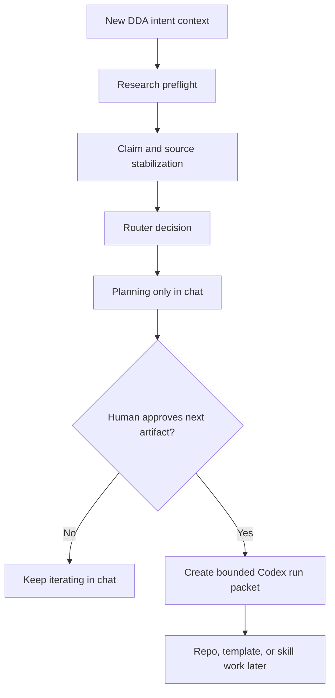
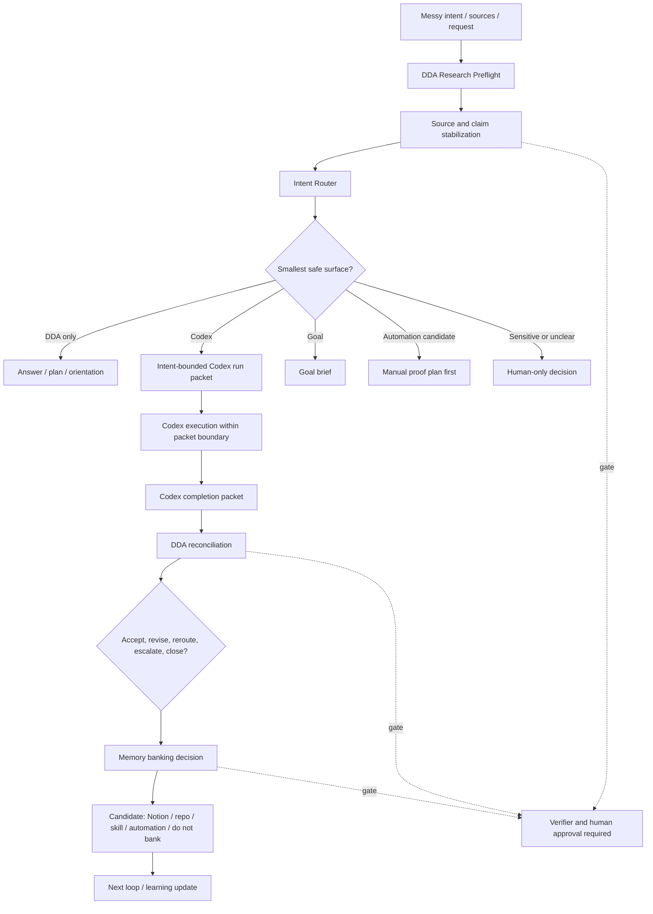

# DDA v2 Intent Router Fit Test and Operating Model

## Review Boundary

This is a draft/review-only planning artifact that captures the synthesized DDA v2 intent-router context, the old-vs-new comparison, the workflow diagrams, the router fit test, and the proposed router matrix packet.

This artifact does not approve:

- repo source rewrites
- PRD v0.3
- skill creation
- Notion writes
- Slack or Linear posts
- persistent memory writes
- automation creation or enablement
- commits, pushes, pull requests, or merges
- runtime readiness
- canonical source-of-truth changes

## Source Basis

| Source | Type | How it was used |
|---|---|---|
| Notion `DDA Intent Router - Context` | Current Notion context | Primary source for DDA as intent-stabilization, routing, reconciliation, and memory layer. |
| Notion `Daily Driver Agent - Positioning Reframe Note` | Prior reframe context | Used to compare Diarized Daily Assistant vs Daily Driver Agent. |
| Notion `Daily Driver Agent - ASSET Scoping Doc v0.1` | Scoping context | Used for session orientation, pre-stage, dispatch, and manual-before-automation posture. |
| Notion `Session Orientation Skill Spec - Daily Driver Agent` | Skill spec | Used for orientation brief, retrieval order, and proposal-only behavior. |
| Notion `Workflow Pre-Staging Skill Spec - Daily Driver Agent` | Skill spec | Used for pre-staged artifact behavior and approval gates. |
| Notion `Session State Object Spec - Daily Driver Agent` | State object spec | Used for live state object and state-snapshot relationship. |
| Repo `AGENTS.md` | Repo operating rule | Used for role boundaries, workloop, approval gates, and write constraints. |
| Repo DDA source files | Current durable repo baseline | Used to compare current repo framing against new Notion direction. |
| Prior May 22 run artifacts | Draft review context | Used for state-map and AGENTS rule-fit continuity. |

## Current Synthesis

The new DDA direction is not only:

```text
Diarized Daily Assistant -> Daily Driver Agent
```

It has moved one layer deeper:

```text
Daily Driver Agent -> DDA Intent Router
```

DDA should become the intent-stabilization and routing layer for Systems Shaper work. Its core value is preserving human intent across AI-assisted execution by stabilizing source context, classifying work shape, routing to the smallest safe execution surface, requiring proof, enforcing gates, and deciding what should survive as memory, doctrine, skill, automation candidate, or nothing.

## Old vs New Direction

| Area | Old DDA / Workspace Agent Pilot | New DDA Intent Router Direction |
|---|---|---|
| Core job | Daily alignment and logging. | Intent stabilization, routing, and reconciliation. |
| Trigger | Morning, midday, evening rhythm. | Any messy request, session start, work-routing moment, or completion review. |
| User posture | User brings context, DDA organizes it. | DDA retrieves and stabilizes source context before routing. |
| Main artifact | Daily game plan, report, tomorrow seed. | Research preflight, routing decision, bounded run packet, completion reconciliation. |
| Codex role | Execution after DDA handoff. | Intent-to-execution substrate after a scoped packet. |
| Memory role | Candidate list after daily work. | Explicit memory banking decision: candidate vs approved. |
| Main risk | DDA collapses into Codex execution. | DDA routes unstable intent too early. |
| Proof target | Complete manual day loop. | Fresh agent can reconstruct intent, source claims, gates, proof, and next action. |
| Automation posture | Future candidate after manual runs. | Still future-only; manual proof required before recurrence. |

## Current Router Decision For This Planning Work

```text
Human intent:
Understand the new DDA intent-router direction and decide what to build next.

Work shape:
Research synthesis + workflow architecture + skill planning.

Recommended surface:
DDA-only planning in chat for now.

Artifact:
Router fit test + proposed next packet shape.

Verifier:
Output preserves source boundaries, gates, next-step sequence, and avoids premature repo or automation work.

Human gate:
User approval required before repo write, Notion write, skill creation, memory banking, or automation.

Memory path:
Candidate only. Do not save to persistent memory.

Next loop:
If accepted, create a bounded repo artifact or DDA-to-Codex skill-build run packet.
```

## Workflow Diagram - Current Fit Test



## Workflow Diagram - DDA v2 Intent Router



## Fit Test Objective

The fit test asks whether the new DDA intent-router model can correctly decide:

1. What kind of work this is.
2. Whether it needs preflight first.
3. Which surface should handle it.
4. What artifact proves progress.
5. What gate prevents premature action.
6. What learning should survive.

## Router Matrix Fit Test

| Test Case | Work Shape | Correct Route | Required Artifact | Verifier | Gate | Result |
|---|---|---|---|---|---|---|
| Analyze new DDA intent context from Notion and compare old vs new direction. | Research synthesis + workflow design. | DDA Research Preflight, then chat synthesis. | Source/claim/gap summary + workflow plan. | Sources are separated; old/new claims are not blended. | No repo/Notion writes. | PASS |
| Turn this into a repo template or skill later. | Repo/docs implementation candidate. | Codex, but only after bounded run packet. | DDA-to-Codex intent-bounded run packet. | File scope, acceptance criteria, no-touch paths, diff check. | Human approval before writing. | PASS, not ready yet |
| Make this run every morning as Daily Driver orientation. | Automation candidate. | Manual pilot first, not automation. | Manual orientation run packet + 3-run evidence log. | Stable trigger/input/output/fallback proven. | Approval before automation. | PASS, blocked from automation |
| Pre-stage a Slack/Linear/Notion update from the analysis. | External-write draft candidate. | DDA pre-staging only. | Draft message/note/page proposal. | Human reviews exact text and target surface. | Approval before send/post/create. | PASS |
| Bank this as memory/doctrine. | Memory/doctrine candidate. | Memory Banking Decision, not automatic memory. | Candidate list: what, why, where, approval owner. | Candidate vs approved clearly labeled. | Approval before persistent memory or canon. | PASS |

## Main Finding

The router works only if Research Preflight happens before routing.

Without preflight, DDA risks sending broad, unstable context into Codex too early. With preflight, DDA can say:

- This is analysis, not implementation.
- This is a planning artifact, not durable truth.
- This may become a skill or template later, but not yet.
- The next proof is a bounded manual test, not automation.

## DDA v2 Router Matrix Packet

### Purpose

Define how DDA turns messy intent into the smallest safe, verifiable next action.

### Operating Contract

DDA v2 exists to protect intent across AI-assisted work.

It does this by:

1. Stabilizing intent.
2. Stabilizing source context.
3. Classifying the work shape.
4. Routing to the smallest appropriate surface.
5. Creating a bounded artifact packet.
6. Checking proof and risk on return.
7. Deciding what should survive as memory, doctrine, skill, automation, or nothing.

DDA should not become the execution engine. Codex, `/goal`, automation, browser/computer use, or human-only review are routed surfaces.

### Core Workflow

```text
messy intent
-> research preflight
-> claim/source stabilization
-> work-shape classification
-> routing decision
-> bounded packet
-> execution or human decision
-> completion reconciliation
-> memory / next-loop decision
```

### Work-Shape Taxonomy

| Work Shape | Meaning | Default Route |
|---|---|---|
| Research synthesis | Messy sources, claims, comparison, doctrine. | DDA Research Preflight. |
| Repo implementation | Files, docs, code, tests, repo changes. | Codex. |
| Workflow design | Process, packets, skill plan, operating model. | DDA planning, then Codex if writing. |
| Durable objective | Clear end state needing persistent follow-through. | `/goal` candidate. |
| Recurring task | Report, monitor, reminder, repeated check. | Manual proof first, automation later. |
| GUI/browser task | Requires logged-in or visual interaction. | Browser/computer use with proof pack. |
| External update | Slack, Linear, Notion, email. | Draft only, human approval before send. |
| Sensitive/ambiguous | High-risk, unclear, private, approval-heavy. | Human-only. |

### Router Matrix

| Input Condition | DDA Action | Route | Required Artifact | Gate |
|---|---|---|---|---|
| Messy source stack. | Run preflight. | DDA. | Research Preflight Packet. | Do not execute yet. |
| Clear bounded repo task. | Build run packet. | Codex. | Intent-Bounded Run Packet. | Approval before writes if not already granted. |
| Returned Codex output. | Reconcile. | DDA. | Completion Reconciliation Packet. | Do not treat as accepted automatically. |
| Reusable pattern found. | Evaluate packaging. | DDA. | Skill/automation candidate review. | Approval before creating. |
| Repeated manual workflow. | Prove manually. | DDA/manual. | Pilot evidence log. | No automation until stable. |
| External-facing draft needed. | Pre-stage. | DDA. | Slack/Linear/Notion/email draft. | Human send/post/create gate. |
| No verifier exists. | Pause. | Human-only. | Decision note. | Define verifier first. |

## Packet Set

### Packet 0: Research Preflight Packet

```text
User intent
Sources available
Source access status
Major claims
Assumptions / unknowns
Conflicts or tension
Governing frame
Likely misread
Readiness to route
Recommended next move
```

### Packet 1: Intent-Bounded Run Packet

```text
Human intent
Work shape
Recommended surface
Routing rationale
Scope boundary
Inputs
Required artifact
Verifier
Human gate
Stop conditions
Return format
```

### Packet 2: Completion Reconciliation Packet

```text
Original intent
Run outcome
Artifact produced
Evidence and verification
Files/systems touched
Decisions made
Open risks
Human review needed
Memory candidates
Recommended next loop
```

### Packet 3: Memory Banking Decision

```text
What happened
What learning may survive
Best home: repo / Notion / memory / skill / automation / do not bank
Candidate vs approved
Approval owner
Promotion gate
Next review point
```

## Skill Creation Plan

Recommended build order:

1. `dda-research-preflight`
2. `dda-intent-router`
3. `dda-run-packet-builder`
4. `dda-completion-reconciler`
5. `dda-memory-banking-decision`
6. `session-orientation`
7. `workflow-pre-staging`

Rationale:

- `session-orientation` is already well-scoped, but the newest Notion intent makes the router the backbone.
- Orientation should become one use case of the router, not the whole DDA.
- The first skill to stabilize should be the routing layer that prevents premature execution.

Recommended umbrella skill:

```text
dda-codex-intent-router
```

Recommended modes:

- Research Preflight Mode
- Intent Router Mode
- Run Packet Mode
- Completion Reconciliation Mode
- Memory Banking Mode

## Manual Pilot Test Plan

Before creating skills or repo docs, test the router on 3 real tasks:

1. A messy Notion/research synthesis task.
2. A bounded Codex repo/documentation task.
3. A pre-staged external update or handoff task.

Pass condition:

```text
DDA correctly identifies work shape, route, artifact, verifier, gate, and memory path without prematurely writing, automating, or claiming canon.
```

## Recommended Next Packet

The next packet to draft should be:

```text
DDA v2 Intent Router Operating Model
```

Recommended posture:

- Draft in chat first.
- If accepted, save as a review-only run artifact.
- Only after review, decide whether to create repo templates, skill specs, or PRD updates.

## Open Questions

1. Should `dda-codex-intent-router` be one skill with modes, or multiple smaller skills with a thin router entrypoint?
2. Should Research Preflight always run for messy source stacks, or only when the request has doctrine, implementation, or memory implications?
3. What is the minimum verifier required for non-code work?
4. What counts as enough manual proof before a repeated workflow can become a skill, automation, or subagent?
5. Should the first durable repo update be a run artifact, a template update, or a source-file PRD/app-flow rewrite?

## Completion Notes

This artifact captures the synthesized context and fit test through the current planning packet. It preserves the current boundary: this is saved for review and continuity, not promoted to canonical DDA source.
